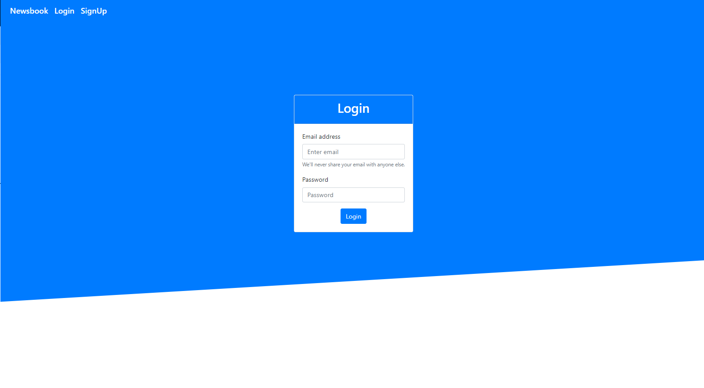
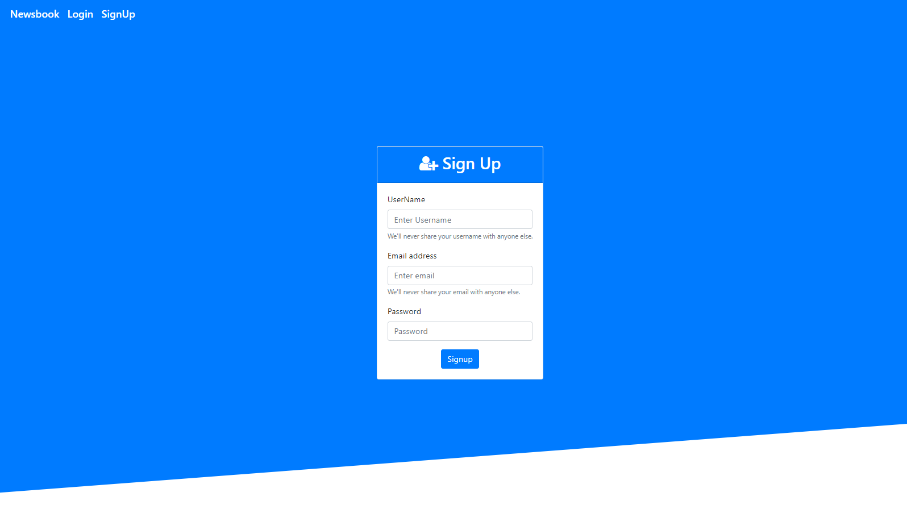
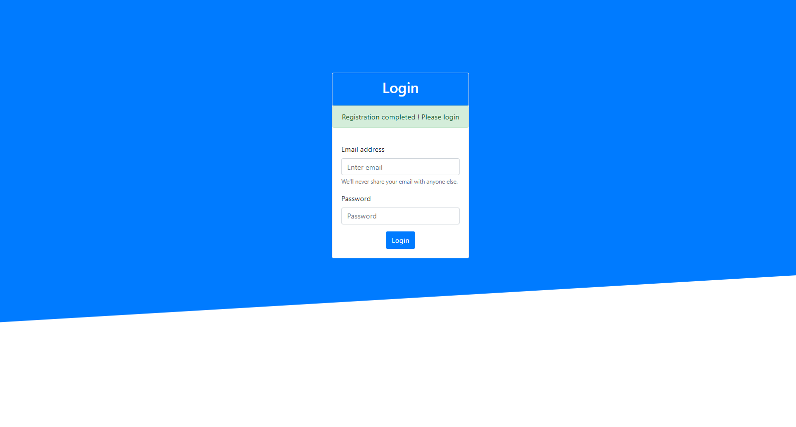
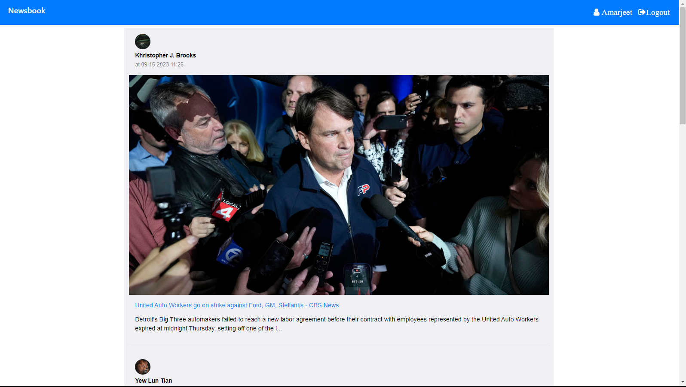

# Newsbook
Newsbook is a web application that aggregates news articles from various sources, allowing users to stay updated with the latest headlines and articles. Built using modern web technologies, this project provides a user-friendly interface for browsing and searching news content from different categories and publishers.
 Watch [Newsbook Tutorial](https://drive.google.com/file/d/1LN7EToPOIuo2FYTJMZuhRcExK7HEBN-I/view?usp=drive_link)

## Installation
1. Clone this repository.
2. Create a virtual host for your application and map it into config.php
3. Change configuration of database as according to your DBMS in config.php
4. Request the url  **your_app_base_path/database/create-user-table**  For example "http://news-api.localhost/database/create-user-table".

## Usage
1. Register yourself in the application with signup form.
2. Try to login yourself in the application.
3. Hurray! Enjoy the latest news feed in no time.

## Features
* Follow MVC architecture.
* Signup/Login functionality for users.
* Display the news in a scrollable list format.
* Implemented pagination.
* Jquery card plugin integration 
* News API Integration via AJAX.

## Screenshots

